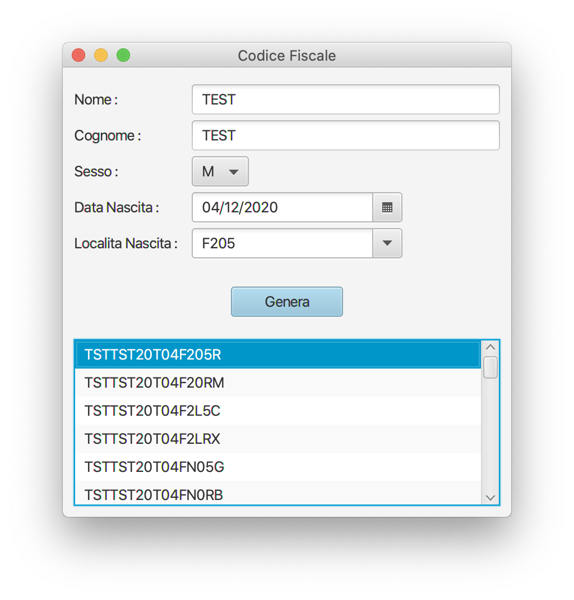

# Codice Fiscale
Calcola il Codice Fiscale con gli omocodi (Tesbed for experiments)

## Features
- [x] Executable Jar
- [x] MacOS Application 
- [x] Swing UI (Groovy SwingBuilder)
- [x] JavaFX UI
- [ ] Web UI
- [ ] CLI (picocli?)
- [ ] Open data integration

JavaFX

GroovySwingBuilder

