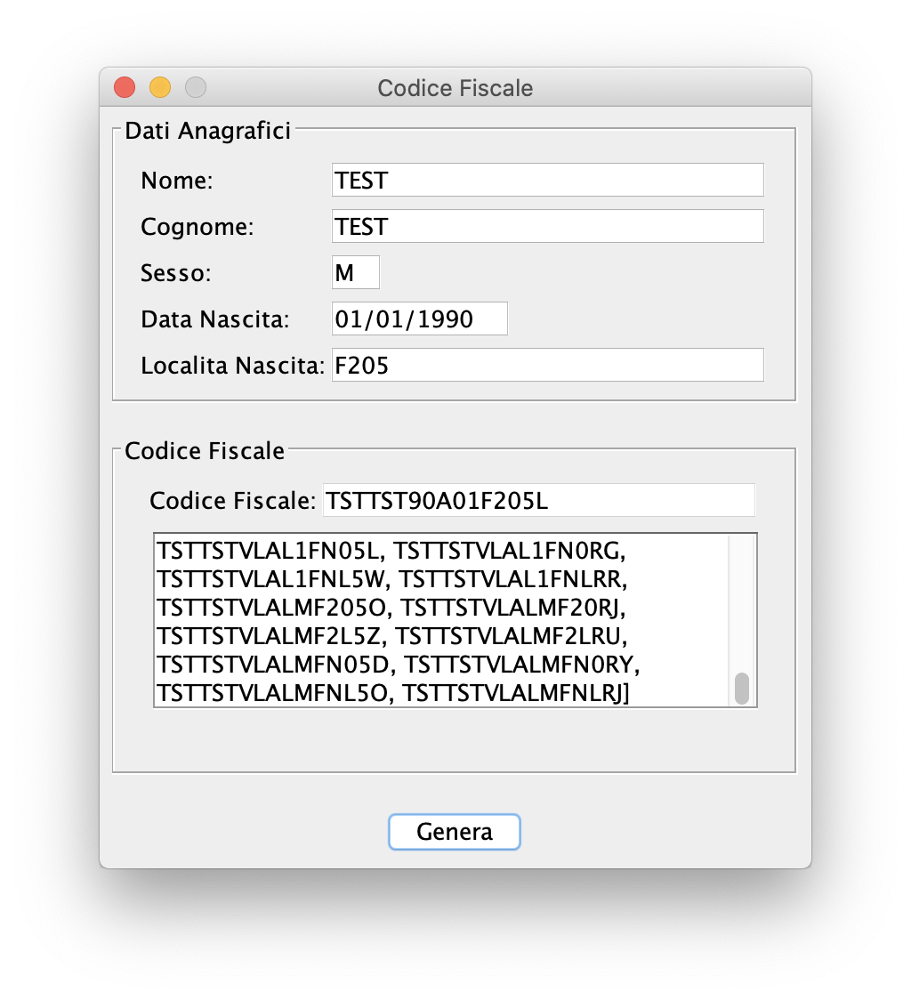

# Codice Fiscale

Codice Fiscale is a experimental utility that encode personal data to Italian Tax Code (Codice Fiscale)

## Features

- Random Data Generator with dictonary
- Generate Codes with Omocodia (if two or more people have the same personal data)
- Searchable birthplaces list
- Desktop application for MacOs, Windows and Linux

## Future enhancements

- [ ] Web UI
- [ ] CLI (picocli?)
- [ ] Open data 
- [ ] Almost useless english localization

## JavaFx UI

## Groovy SwingBuilder (Legacy UI)

## License

